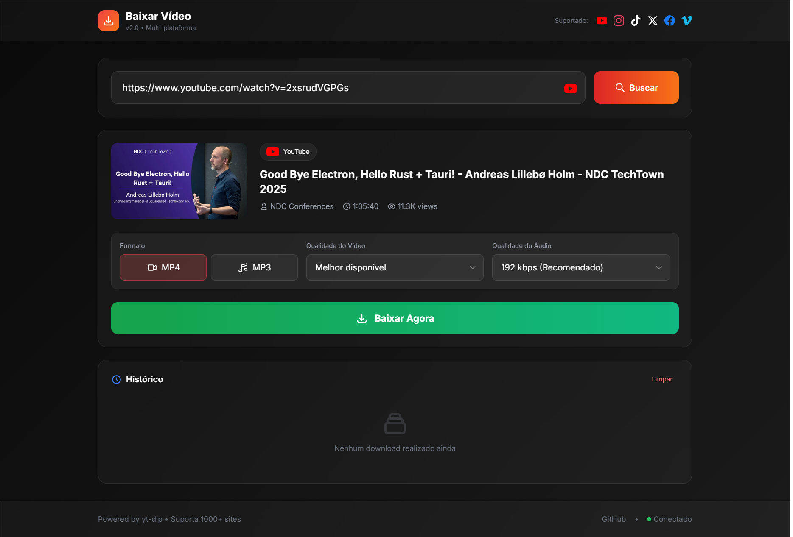

<div align="center">

# Baixar Vídeo

### Ferramenta profissional para download de vídeos

<br/>

[](https://python.org)
[](https://fastapi.tiangolo.com)
[](https://github.com/yt-dlp/yt-dlp)
[](LICENSE)

<br/>

**Plataformas Suportadas**

[](https://youtube.com)
[](https://instagram.com)
[](https://tiktok.com)
[](https://x.com)
[](https://facebook.com)
[](https://vimeo.com)
[](https://twitch.tv)
[](https://reddit.com)

</div>

---

<div align="center">



</div>

## Visão Geral

Aplicação web de código aberto para download de vídeos de diversas plataformas. Interface moderna com suporte a múltiplos formatos, qualidades e playlists.

### Funcionalidades Principais

| Recurso                  | Descrição                                            |
| ------------------------ | ---------------------------------------------------- |
| **Multi-formato**        | Download em MP4 (vídeo) ou MP3 (áudio)               |
| **Seleção de qualidade** | 360p, 480p, 720p, 1080p, 1440p, 4K                   |
| **Suporte a playlists**  | Download de playlists com seleção individual         |
| **Preview**              | Visualização de informações antes do download        |
| **Fila de downloads**    | Processamento sequencial com progresso em tempo real |
| **Histórico**            | Registro persistente de downloads realizados         |
| **Multi-plataforma**     | Suporte a 1000+ sites via yt-dlp                     |

---

## Arquitetura

```
┌─────────────────────────────────────────────────────────────────┐
│                         CLIENTE                                  │
│  ┌───────────────────────────────────────────────────────────┐  │
│  │                    Interface Web                           │  │
│  │              HTML + Tailwind + Socket.IO                   │  │
│  └───────────────────────────────────────────────────────────┘  │
└─────────────────────────────────────────────────────────────────┘
                              │
                              │ WebSocket / HTTP
                              ▼
┌─────────────────────────────────────────────────────────────────┐
│                         SERVIDOR                                 │
│  ┌─────────────┐  ┌─────────────┐  ┌─────────────────────────┐  │
│  │   FastAPI   │  │  Socket.IO  │  │      SQLite (async)     │  │
│  │   (REST)    │  │  (Realtime) │  │       Histórico         │  │
│  └─────────────┘  └─────────────┘  └─────────────────────────┘  │
│                              │                                   │
│  ┌───────────────────────────────────────────────────────────┐  │
│  │                    Download Engine                         │  │
│  │         yt-dlp + FFmpeg + POT Provider (anti-bot)          │  │
│  └───────────────────────────────────────────────────────────┘  │
└─────────────────────────────────────────────────────────────────┘
```

### Stack Tecnológica

| Camada          | Tecnologia                      |
| --------------- | ------------------------------- |
| Runtime         | Python 3.11+                    |
| Framework       | FastAPI + Uvicorn               |
| Realtime        | python-socketio                 |
| Database        | SQLite + aiosqlite + SQLAlchemy |
| Download        | yt-dlp + FFmpeg                 |
| Auth            | bgutil-ytdlp-pot-provider       |
| Package Manager | UV                              |

---

## Instalação

### Requisitos

- Python 3.11 ou superior
- FFmpeg instalado e no PATH
- Docker (opcional, para POT Provider)

### Desenvolvimento Local

```bash
# Clonar repositório
git clone <url-do-repositorio>
cd baixar-video

# (Opcional) Iniciar POT Provider para bypass de proteções
docker run -d -p 4416:4416 --name pot-provider brainicism/bgutil-ytdlp-pot-provider

# Instalar dependências
pip install uv
uv sync

# Iniciar servidor
uv run uvicorn src.main:socket_app --reload --host 0.0.0.0 --port 8000
```

### Produção (Docker Compose)

```bash
docker compose up -d
```

---

## Estrutura do Projeto

```
baixar-video/
├── src/
│   ├── main.py             # Aplicação FastAPI + rotas + eventos Socket.IO
│   ├── downloader.py       # Serviço de download (yt-dlp wrapper)
│   ├── preview.py          # Serviço de preview (extract_info)
│   ├── queue_manager.py    # Gerenciador de fila de downloads
│   ├── database.py         # Conexão SQLite + CRUD
│   ├── models.py           # Schemas Pydantic + modelos SQLAlchemy
│   ├── settings.py         # Configurações centralizadas
│   └── templates/
│       └── index.html      # Interface web (SPA)
├── data/                   # Banco de dados SQLite
├── downloads/              # Arquivos baixados (temporário)
├── pyproject.toml          # Dependências (PEP 621)
├── Dockerfile              # Build de produção
├── docker-compose.yml      # Orquestração
└── README.md
```

---

## API Reference

### Endpoints REST

| Método   | Endpoint                 | Descrição                           |
| -------- | ------------------------ | ----------------------------------- |
| `GET`    | `/`                      | Interface web                       |
| `GET`    | `/api/preview?url=`      | Obtém informações do vídeo/playlist |
| `POST`   | `/api/download`          | Inicia novo download                |
| `GET`    | `/api/download/{job_id}` | Status de um download               |
| `DELETE` | `/api/download/{job_id}` | Cancela download                    |
| `GET`    | `/api/queue`             | Estado da fila                      |
| `GET`    | `/api/history`           | Histórico de downloads              |
| `DELETE` | `/api/history/{job_id}`  | Remove do histórico                 |
| `DELETE` | `/api/history`           | Limpa histórico                     |
| `GET`    | `/api/files/{filename}`  | Download de arquivo                 |
| `GET`    | `/api/info`              | Informações da aplicação            |

### Eventos Socket.IO

| Evento              | Direção         | Descrição                  |
| ------------------- | --------------- | -------------------------- |
| `start_download`    | Client → Server | Inicia download            |
| `download_queued`   | Server → Client | Download adicionado à fila |
| `download_progress` | Server → Client | Progresso do download      |
| `download_complete` | Server → Client | Download concluído         |
| `download_error`    | Server → Client | Erro no download           |
| `queue_update`      | Server → Client | Atualização da fila        |

---

## Configuração

| Variável           | Descrição           | Padrão                  |
| ------------------ | ------------------- | ----------------------- |
| `PORT`             | Porta do servidor   | `8000`                  |
| `POT_PROVIDER_URL` | URL do POT Provider | `http://localhost:4416` |

---

## Troubleshooting

| Problema               | Causa Provável         | Solução                                    |
| ---------------------- | ---------------------- | ------------------------------------------ |
| Erro 403 Forbidden     | POT Provider inativo   | Verificar `docker ps` ou iniciar container |
| Áudio não reproduz     | Codec incompatível     | FFmpeg converte para AAC automaticamente   |
| Download não inicia    | URL inválida           | Verificar se a plataforma é suportada      |
| Progresso não atualiza | WebSocket desconectado | Verificar conexão no footer da interface   |

---

## Licença

Distribuído sob a licença MIT. Veja [LICENSE](LICENSE) para mais informações.

---

## Aviso Legal

Esta ferramenta destina-se exclusivamente a fins educacionais e pessoais. O usuário é integralmente responsável por garantir que a utilização esteja em conformidade com os termos de serviço das plataformas e a legislação de direitos autorais vigente.

---

<div align="center">

**Desenvolvido com FastAPI e yt-dlp**

[](https://python.org)
[](https://fastapi.tiangolo.com)

</div>
